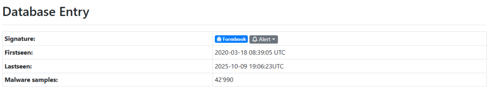
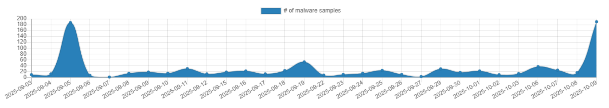

I have always wondered how certain individuals and security systems can be fooled by malware used by APTs or other attackers. For that reason I decided to take an interest in the subject and ask myself this question: "Why are systems designed to prevent threats still deceived by malware of high or low sophistication?" That’s when I got started in malware analysis, beginning with a solid introduction from Uriel Kosayev’s book [Malware Analysis on Steroids](https://www.amazon.com/MAoS-Analysis-Steroids-Real-World-Engineering/dp/B0FQDGZGZW). In this article, we will study in detail the process of analyzing a piece of malware using a sandbox environment and examine its behavior to understand which techniques it uses to blind the most advanced detection and security systems on the market.

However, as a first step, it seems important to understand and define what a "malware" is. A malware (short for malicious software) is not merely a "program" in the broad sense it is an organized collection of malicious software components or code blocks, designed to be executed on a target (such as a user process, kernel, firmware, or embedded device) in order to compromise the confidentiality, integrity, or availability of that target, or to derive economic or strategic benefits from it.

For our analysis, we are examining a malware sample in the form of a Windows executable file (.exe), based on the standard MS-DOS Portable Executable (PE) format. The sample was obtained from [MalwareBazaar](https://bazaar.abuse.ch/), a platform that aggregates and shares malware samples of various types and formats, categorized under different families such as Mirai, FormBook, and others.

According to the information provided by MalwareBazaar, and as shown below, the most prevalent malware family associated with our sample is FormBook. FormBook is an information stealer and keylogger that captures keystrokes, extracts stored credentials and authentication data from web browsers, and takes screenshots of the victim’s system.

Below, we can also see statistics showing the periods during which this malware signature was observed.

